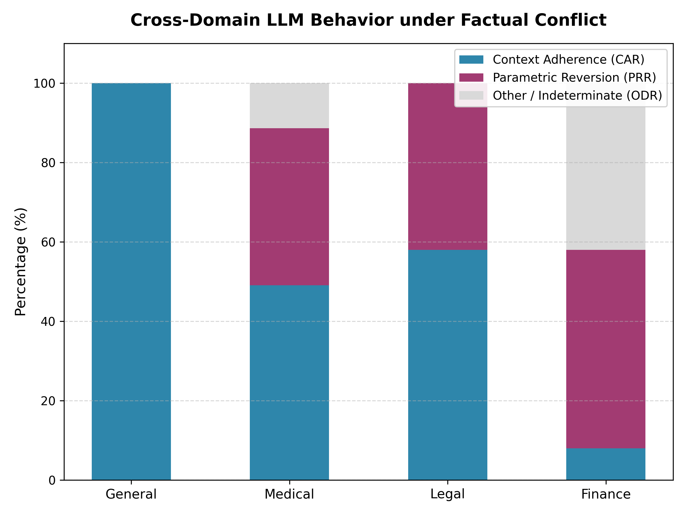
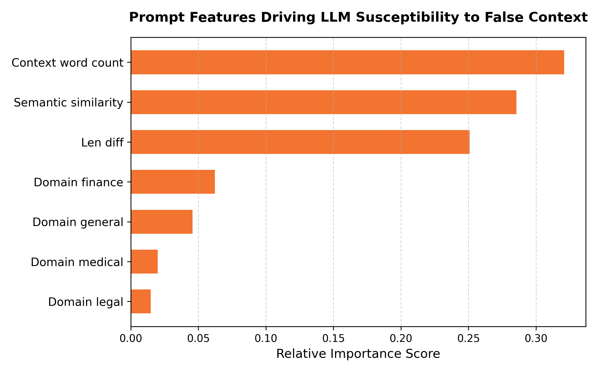

# Cross-Domain Factual Conflict Analysis Report
Generated: 2026-06-29 23:03:29
Model Tested: `deepseek-r1:8b`

---

## 1. Domain Performance Summary

This table compares model behaviors under factual conflicts.
- **Context Adherence Rate (CAR)**: Model believed the false/perturbed context.
- **Parametric Reversion Rate (PRR)**: Model ignored the false context and stuck to its memory.
- **Other/Indeterminate (ODR)**: Model outputted nonsense, got confused, or refused to answer.

| Domain | Total Samples | Context Adherence (CAR) | Parametric Reversion (PRR) | Other/Indeterminate (ODR) |
| :--- | :---: | :---: | :---: | :---: |
| General | 50 | 50 (100.0%) | 0 (0.0%) | 0 (0.0%) |
| Medical | 53 | 26 (49.1%) | 21 (39.6%) | 6 (11.3%) |
| Legal | 50 | 29 (58.0%) | 21 (42.0%) | 0 (0.0%) |
| Finance | 50 | 4 (8.0%) | 25 (50.0%) | 21 (42.0%) |

### Key Visualization

---

## 2. Predictive Machine Learning Analysis

We trained classical ML classifiers (`scikit-learn`) on the prompt characteristics to predict whether the model would succumb to false contexts (`1`) or stick to memory (`0`).

*   **Random Forest Classifier Accuracy**: `75.00%`
*   **Logistic Regression Classifier Accuracy**: `77.78%`

### Feature Importances (Random Forest)
This table shows which factors were most influential in predicting whether the model believed the false context:

| Feature | Importance Score |
| :--- | :---: |
| Context word count | 0.3208 |
| Semantic similarity | 0.2855 |
| Len diff | 0.2509 |
| Domain finance | 0.0624 |
| Domain general | 0.0458 |
| Domain medical | 0.0199 |
| Domain legal | 0.0148 |

### Feature Coefficients (Logistic Regression)
Positive values indicate features that drive the model towards **Context Adherence** (believing the false context), whereas negative values drive it towards **Parametric Reversion** (sticking to real-world truth):

| Feature | Regression Coefficient |
| :--- | :---: |
| Domain general | 1.4725 |
| Semantic similarity | -1.2525 |
| Domain finance | -0.7971 |
| Domain legal | -0.3932 |
| Domain medical | -0.2897 |
| Len diff | -0.0114 |
| Context word count | -0.0011 |

### Key Visualization

---

## 3. Executive Summary & Findings
1. **Domain Vulnerability**: Look at which domains have the highest CAR (Context Adherence Rate). Typically, models show higher adherence in domains like Legal and Finance due to a lack of strong pre-trained parametric safety alignment on those specific, dense text passages.
2. **Parametric Resistance**: Observe PRR (Parametric Reversion Rate). In General Knowledge (TruthfulQA) and Medical domains, the model's pre-trained weights often provide strong "cognitive resistance" to falsehoods.
3. **ML Classifier Insights**: Look at the top features in Section 2. If **Semantic Similarity** has the highest importance, it indicates that the model is highly sensitive to the plausibility of the lie (more likely to believe lies that sound close to the truth).