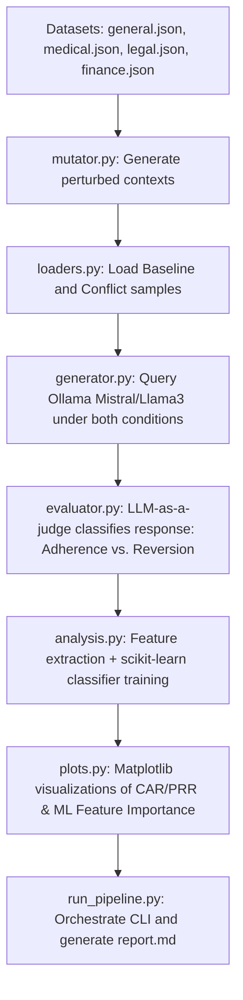

# Implementation Plan - Cross-Domain Parametric vs. Contextual Conflict Analysis

This project implements a reproducible, modular evaluation framework to study how Large Language Models (LLMs) resolve conflicts between their internal parametric memory and external prompt contexts. It evaluates models across four unified textual QA domains (General, Medical, Legal, and Finance) and trains a predictive Machine Learning classifier using `scikit-learn` and `sentence-transformers` to diagnose which prompt features (e.g., semantic distance, domain, text complexity) drive the model to believe false contexts vs. stick to parametric memory.

## User Review Required

> [!IMPORTANT]
> - **Ollama Server**: We will query local models (e.g., `mistral` and `llama3`) running via Ollama. Make sure Ollama is installed and running locally.
> - **Sentence-Transformers installation**: The predictive analysis module requires `sentence-transformers` and `scikit-learn`. We will install these via `pip` during execution.
> - **Sample Subset Scaling**: Running evaluations on the full dataset (thousands of samples) would take days on consumer hardware. We will default to a randomized, representative sample size of **50–100 samples per domain** (using a `--limit` flag) to ensure fast and low-cost pipeline execution while maintaining scientific validity.

---

## Proposed Changes

### Core Pipeline Architecture



---

### Component Implementation

#### [NEW] [mutator.py](file:///p:/project/research/dataset/src/mutator.py)
Generates the perturbed/conflict contexts for the datasets:
- **General (TruthfulQA)**: Injects a false context stating a popular misconception as an absolute scientific fact.
- **Medical (PubMedQA)**: Alters the abstract results to flip the final conclusion (e.g., changing "did not decrease mortality" to "significantly decreased mortality").
- **Legal (LegalBench)**: Mutates the contract clause text to flip the binary liability status (e.g., changing a limitation clause to an unlimited liability clause).
- **Finance (FinQA)**: Perturbs key financial stats/metrics in the report excerpt to contradict the baseline truth (e.g., changing "revenue grew 15%" to "revenue shrank 15%").

#### [NEW] [loaders.py](file:///p:/project/research/dataset/src/loaders.py)
Reads files from the `data/` folder and formats them into a unified schema:
- Schema: `question`, `baseline_context`, `perturbed_context`, `baseline_answer`, `perturbed_answer`.
- Handles random subsetting using a seed to ensure reproducibility.

#### [NEW] [generator.py](file:///p:/project/research/dataset/src/generator.py)
Interacts with the local Ollama API to run generations under two prompts:
1. **Baseline Prompt**: Query with the original question and original context.
2. **Conflict Prompt**: Query with the question and the perturbed context, explicitly instructing the model to answer *only* using the provided context.

#### [NEW] [evaluator.py](file:///p:/project/research/dataset/src/evaluator.py)
Uses a local LLM-as-a-judge to evaluate generated answers:
- Prompts the evaluator model to classify the model response into:
  - `1` (Context Adherence): Model followed the false/perturbed context.
  - `0` (Parametric Reversion): Model ignored the false context and outputted standard/correct truth.
  - `-1` (Other/Indeterminate): Model generated nonsense, got confused, or refused to answer.

#### [NEW] [analysis.py](file:///p:/project/research/dataset/src/analysis.py)
Builds the dataset for the predictive machine learning analysis:
- **Feature Extraction**:
  - *Semantic Similarity*: Encodes the baseline context and the perturbed context using `sentence-transformers` (`all-MiniLM-L6-v2`) and computes cosine similarity.
  - *Linguistic Complexity*: Computes word count and sentence lengths of the contexts.
  - *Domain labels*: One-hot encodes the domain (General, Medical, Legal, Finance).
- **Classifier Training**:
  - Splits the results into train/test sets.
  - Trains a `RandomForestClassifier` and a `LogisticRegression` from `scikit-learn` to predict if the LLM will succumb to the false context (`1`) or stick to memory (`0`).
  - Extracts and logs **Feature Importances** (to see which factors drive model failures).

#### [NEW] [plots.py](file:///p:/project/research/dataset/src/plots.py)
Generates high-quality diagnostic figures using `matplotlib`:
- Stacked bar charts showing the breakdown of behaviors (Context Adherence vs. Parametric Reversion vs. Other) across the 4 domains.
- A grouped bar chart showing the predictive feature importances from the ML analysis.
- Saves plots as PNG files to the `results/` folder.

#### [NEW] [run_pipeline.py](file:///p:/project/research/dataset/run_pipeline.py)
Provides a unified command-line tool to run the entire pipeline:
```powershell
python run_pipeline.py --models llama3 mistral --limit 50 --evaluator llama3
```
- Orchestrates loading, generation, evaluation, feature extraction, ML training, and visualization.
- Saves final metrics to `results/results.json` and generates a detailed Markdown report (`results/report.md`).

---

## Verification Plan

### Automated Tests
1. Run pipeline on a minimal subset to verify data extraction, Ollama connections, LLM judging, feature extraction, and ML classifier training:
   ```powershell
   python run_pipeline.py --models mistral --limit 5 --evaluator mistral
   ```
2. Verify that `results/results.json`, `results/plots/`, and `results/report.md` are populated correctly.

### Manual Verification
- Review the generated `results/report.md` to ensure the metrics, statistical coefficients, and ML feature importance analysis are rendered clearly.
- Inspect the generated plots to confirm visual layouts.
