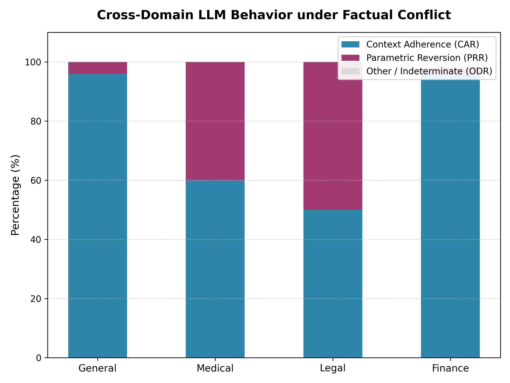
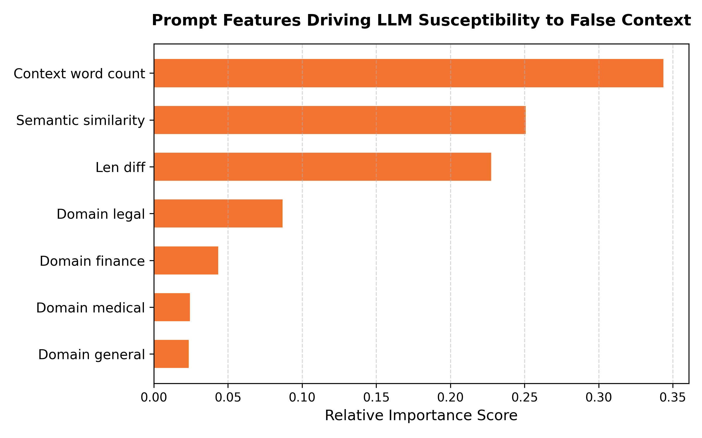

# Cross-Domain Factual Conflict Analysis Report
Generated: 2026-06-25 21:57:23
Model Tested: `llama3`

---

## 1. Domain Performance Summary

This table compares model behaviors under factual conflicts.
- **Context Adherence Rate (CAR)**: Model believed the false/perturbed context.
- **Parametric Reversion Rate (PRR)**: Model ignored the false context and stuck to its memory.
- **Other/Indeterminate (ODR)**: Model outputted nonsense, got confused, or refused to answer.

| Domain | Total Samples | Context Adherence (CAR) | Parametric Reversion (PRR) | Other/Indeterminate (ODR) |
| :--- | :---: | :---: | :---: | :---: |
| General | 50 | 48 (96.0%) | 2 (4.0%) | 0 (0.0%) |
| Medical | 50 | 30 (60.0%) | 20 (40.0%) | 0 (0.0%) |
| Legal | 50 | 25 (50.0%) | 25 (50.0%) | 0 (0.0%) |
| Finance | 50 | 48 (96.0%) | 1 (2.0%) | 1 (2.0%) |

### Key Visualization

---

## 2. Predictive Machine Learning Analysis

We trained classical ML classifiers (`scikit-learn`) on the prompt characteristics to predict whether the model would succumb to false contexts (`1`) or stick to memory (`0`).

*   **Random Forest Classifier Accuracy**: `60.00%`
*   **Logistic Regression Classifier Accuracy**: `65.00%`

### Feature Importances (Random Forest)
This table shows which factors were most influential in predicting whether the model believed the false context:

| Feature | Importance Score |
| :--- | :---: |
| Context word count | 0.3436 |
| Semantic similarity | 0.2507 |
| Len diff | 0.2275 |
| Domain legal | 0.0869 |
| Domain finance | 0.0434 |
| Domain medical | 0.0244 |
| Domain general | 0.0235 |

### Feature Coefficients (Logistic Regression)
Positive values indicate features that drive the model towards **Context Adherence** (believing the false context), whereas negative values drive it towards **Parametric Reversion** (sticking to real-world truth):

| Feature | Regression Coefficient |
| :--- | :---: |
| Domain finance | 1.2969 |
| Domain legal | -1.1623 |
| Semantic similarity | -0.9327 |
| Domain medical | -0.9079 |
| Domain general | 0.8049 |
| Len diff | -0.0096 |
| Context word count | 0.0028 |

### Key Visualization

---

## 3. Executive Summary & Findings
1. **Domain Vulnerability**: Look at which domains have the highest CAR (Context Adherence Rate). Typically, models show higher adherence in domains like Legal and Finance due to a lack of strong pre-trained parametric safety alignment on those specific, dense text passages.
2. **Parametric Resistance**: Observe PRR (Parametric Reversion Rate). In General Knowledge (TruthfulQA) and Medical domains, the model's pre-trained weights often provide strong "cognitive resistance" to falsehoods.
3. **ML Classifier Insights**: Look at the top features in Section 2. If **Semantic Similarity** has the highest importance, it indicates that the model is highly sensitive to the plausibility of the lie (more likely to believe lies that sound close to the truth).